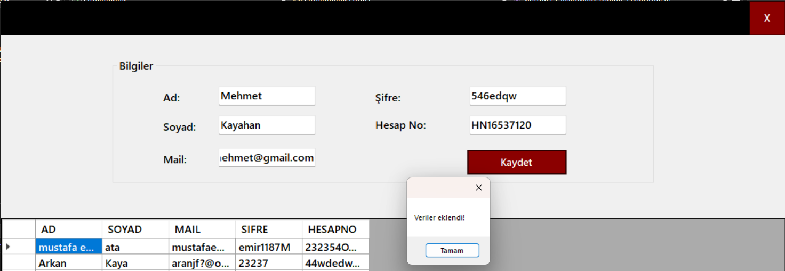
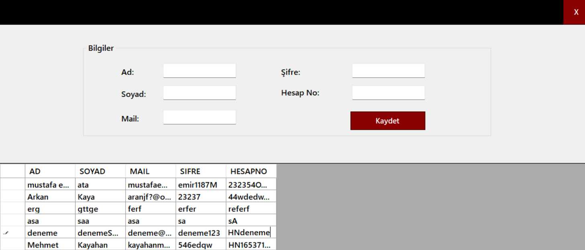
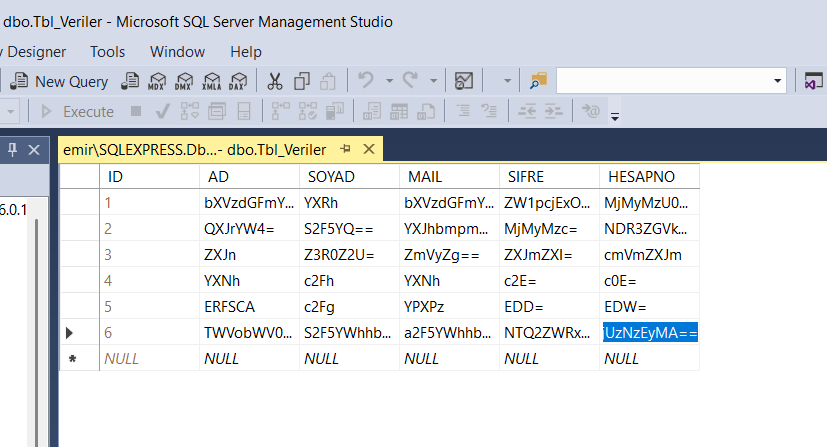

# Veritaban-Sifreleme
## Bu projede, form üzerinden girilen veriler veritabanına şifrelenerek aktarılır. Form üzerinde kayıtlı veriler ise şifreleri çözülerek tekrar gösterilir. Bu sayede veritabanına veri gönderilirken temel şifrelendirmeler kullanılmış olunur.

